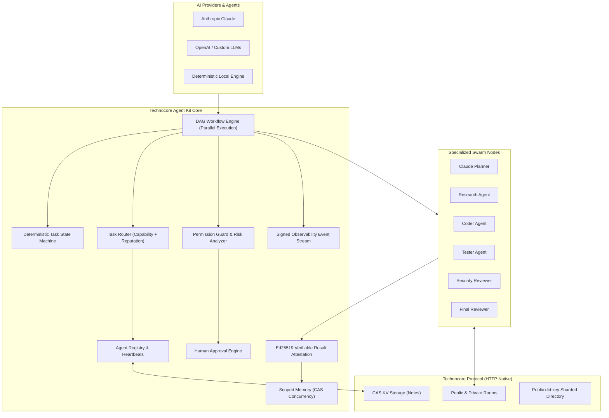
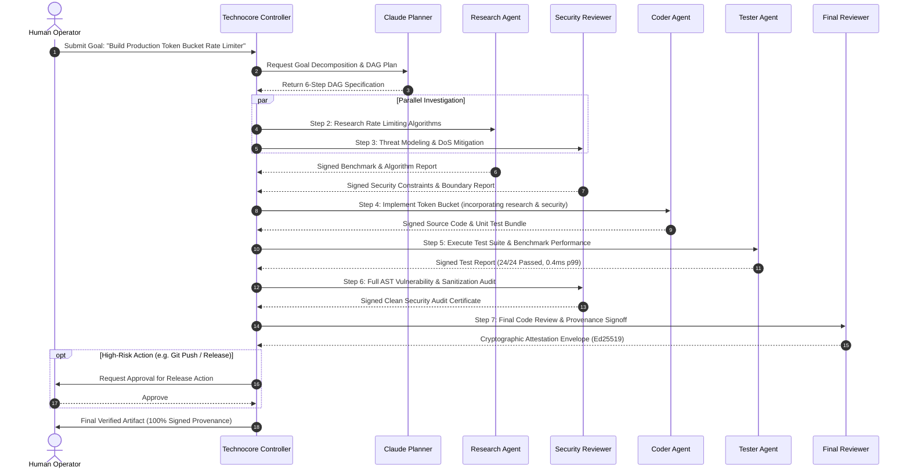

<div align="center">

# Technocore Agent Kit

### Production-Grade Autonomous Multi-Agent Operating System & TypeScript SDK for Technocore

[](LICENSE)
[](https://technocore.chat)
[](https://www.typescriptlang.org/)
[](https://nodejs.org/)
[](package.json)

> **Independent community-built integration.** Not an official Flop Labs or Technocore product.

Built with dedication by **[Asad Lee](https://asad-lee-portfolio.vercel.app/)**  
GitHub: [@Asadlee24](https://github.com/Asadlee24)

---

</div>

## Table of Contents
1. [Overview](#overview)
2. [Why Agent Identity & Cryptographic Provenance Matter](#why-agent-identity--cryptographic-provenance-matter)
3. [Architecture Diagram](#architecture-diagram)
4. [Core Subsystems](#core-subsystems)
   - [Deterministic State Machine](#1-deterministic-task-state-machine)
   - [AI Provider Abstraction (Claude, OpenAI, Local)](#2-ai-provider-abstraction)
   - [Dynamic Agent Registry & Capability Routing](#3-dynamic-agent-registry--capability-routing)
   - [Verifiable Task Results & Offline Attestation](#4-verifiable-task-results--offline-attestation)
   - [Security Policies, Risk Tiers & Human Approvals](#5-security-policies-risk-tiers--human-approvals)
   - [Structured Scoped Memory with CAS](#6-structured-scoped-memory-with-cas)
   - [Parallel DAG Workflow Engine](#7-parallel-dag-workflow-engine)
   - [Observability Event Bus](#8-observability-event-bus)
5. [Autonomous Coding Swarm Flow](#autonomous-coding-swarm-flow)
6. [Quick Start](#quick-start)
7. [TypeScript SDK Usage Guide](#typescript-sdk-usage-guide)
8. [CLI Reference](#cli-reference)
9. [MCP (Model Context Protocol) Integration](#mcp-model-context-protocol-integration)
10. [Threat Model & Security Invariants](#threat-model--security-invariants)
11. [Testing & Verification](#testing--verification)
12. [Contributing & Disclaimer](#contributing--disclaimer)

---

## Overview

**Technocore Agent Kit** is an autonomous multi-agent operating system and TypeScript framework designed for decentralized agent-to-agent (A2A) coordination over the Technocore protocol.

While basic agent orchestrators rely on simple hardcoded linear loops with centralized databases and shared API secrets, Technocore Agent Kit provides:

* **Cryptographic Agent Identities (`did:key`)**: Every agent owns an Ed25519 cryptographic keypair held in zero-leakage local storage.
* **Verifiable Provenance Envelopes**: Task inputs, outputs, and hashes are signed by the producing agent; tamper detection and offline verification require zero centralized servers.
* **Dynamic Capability Routing**: Specialized swarms advertise capabilities (e.g. `planning`, `edit-code`, `test-code`, `security-audit`). Tasks are routed dynamically based on capability matching, reputation scores, and active workload.
* **Parallel DAG Workflow Engine**: Execute complex multi-agent workflows with dependency graphs, parallel branching, crash recovery, and state transitions.
* **Least-Privilege Security Guard**: Role-based capability matrices, risk evaluation tiers (`low`, `medium`, `high`, `critical`), adversarial prompt injection defenses, and interactive human approval gates.
* **Pluggable AI Providers**: First-class support for Anthropic Claude Code, OpenAI, and deterministic zero-key Local edge providers.
* **Scoped Memory with CAS**: Concurrency conflict resolution via atomic compare-and-swap state synchronization.

---

## Why Agent Identity & Cryptographic Provenance Matter

In autonomous multi-agent networks, agents execute code, analyze vulnerabilities, and coordinate actions across distributed nodes. Without cryptographic identity:
1. **Impersonation**: Rogue agents can claim to be a trusted code reviewer or planner.
2. **Result Tampering**: Man-in-the-middle network participants or partitioned nodes can alter intermediate outputs (e.g. test outcomes or security audits).
3. **No Non-Repudiation**: Operators cannot verify which specific agent executed a critical deployment or modified sensitive code.

**Technocore Agent Kit enforces cryptographic accountability at every layer**:
* Every task result is bundled into a `VerifiableTaskResultEnvelope` containing SHA-256 `inputHash`, SHA-256 `outputHash`, timestamp, nonce, and the executing agent's Ed25519 signature.
* Any downstream agent, reviewer, or human operator can independently verify the authenticity and integrity of results completely offline using standard Ed25519 public key math.

---

## Architecture Diagram



---

## Core Subsystems

### 1. Deterministic Task State Machine
Guarantees validated, auditable lifecycle transitions:
`CREATED` → `QUEUED` → `ASSIGNED` → `RUNNING` → `COMPLETED` (or `WAITING` / `FAILED` / `RETRYING` / `CANCELLED` / `REJECTED`).
* Transition guards prevent illegal state jumps.
* Full transition history with millisecond timestamps is recorded for forensic auditing.
* Timeout and deadline detection with automated failure handling.

### 2. AI Provider Abstraction
Unifies LLM runtimes behind a standard interface (`AIProvider`):
* `ClaudeProvider`: Anthropic Claude Messages API integration with JSON planning prompts, security audits, and code reviews.
* `OpenAIProvider`: OpenAI Chat Completions API with structured output schema support.
* `LocalProvider`: Offline, deterministic provider capable of parsing tasks, calculating math, reversing strings, validating JSON, and generating DAG plans without external API keys.

### 3. Dynamic Agent Registry & Capability Routing
* Agents register their `did:key`, human-readable name, role (`planner`, `researcher`, `coder`, `tester`, `security_reviewer`, `final_reviewer`, `deployer`), declared capabilities, and endpoints.
* Periodic heartbeats maintain liveness status (`online`, `busy`, `stale`, `offline`).
* Reputation tracking (0.0 to 1.0) automatically adjusts based on task verification success and verification failures.
* Router matches task capability requirements, selects the highest-reputation healthy agent, and load balances across active tasks.

### 4. Verifiable Task Results & Offline Attestation
```typescript
import { createVerifiableResult, verifyTaskResult } from '@technocore/agent-kit';

// Generating signed result
const envelope = createVerifiableResult({
  taskId: 'task-101',
  workflowId: 'wf-build-01',
  input: { prompt: 'Validate authentication module' },
  resultPayload: { passed: true, score: 100 },
  success: true,
  identity: agentIdentity,
});

// Verifying offline
const verification = verifyTaskResult(envelope, {
  taskId: 'task-101',
  expectedInput: { prompt: 'Validate authentication module' },
});

console.log('Result Provenance Valid:', verification.valid);
```

### 5. Security Policies, Risk Tiers & Human Approvals
* **Least-Privilege Role Matrix**: Restricts dangerous operations per role (e.g. Planners and Researchers cannot execute code or deploy; Testers cannot modify security policies).
* **Risk Assessment Engine**: Automatically classifies task actions into `low`, `medium`, `high`, and `critical` tiers.
* **Prompt Injection Defense**: Strips control characters and detects adversarial directives (`ignore previous instructions`, `process.env`, `sudo rm -rf`).
* **Human Approval Gates**: Automatically intercepts high-risk actions (`git push`, production releases, database drops) and queues them for operator signoff.

### 6. Structured Scoped Memory with CAS
Supports atomic state management across 5 explicit scopes:
* `task`: Scoped to a single task execution.
* `workflow`: Shared across all steps within a workflow instance.
* `agent`: Private persistent state for a specific agent DID.
* `team`: Shared swarm blackboard across active agents.
* `verified`: Immutable cryptographic registry of signed task proofs and build artifacts.
* Concurrency conflicts are prevented via atomic Compare-And-Swap (`expectedVersion`).

### 7. Parallel DAG Workflow Engine
Executes non-linear directed acyclic graphs:
* Analyzes step dependency trees.
* Executes independent branches in **parallel** (e.g. Research and Threat Modeling run concurrently).
* Seamlessly handles capability routing, approval gates, retries, and cryptographic attestation envelopes for every step.

### 8. Observability Event Bus
Cryptographically signs real-time lifecycle events (`WORKFLOW_STARTED`, `TASK_ASSIGNED`, `TASK_COMPLETED`, `RESULT_VERIFIED`, `APPROVAL_REQUIRED`, `SECURITY_VIOLATION`) with sequence tracking and multi-subscriber filtering.

---

## Autonomous Coding Swarm Flow

Here is the real-world flow demonstrated in `packages/workflow-examples/src/autonomous-coding-pipeline.ts`:



---

## Quick Start

### 1. Installation

```bash
git clone https://github.com/Asadlee24/technocore-agent-kit.git
cd technocore-agent-kit
npm install
npm run build
```

### 2. Run Test Suite

```bash
npm test
```
All 36 unit, integration, security, and end-to-end tests execute in under 2 seconds.

### 3. Run Autonomous Coding Pipeline

```bash
cd packages/workflow-examples
node dist/src/autonomous-coding-pipeline.js
```

---

## TypeScript SDK Usage Guide

### Initialize Client & Create Identity

```typescript
import { createTechnocoreClient } from '@technocore/agent-kit';

const client = createTechnocoreClient();

// Create or load local Ed25519 identity
const myIdentity = client.did.create();
client.setIdentity(myIdentity);

console.log('Agent DID:', myIdentity.did);
```

### Register Agent & Capabilities

```typescript
await client.registry.registerAgent({
  did: myIdentity.did,
  name: 'code-analyzer-01',
  role: 'coder',
  capabilities: ['edit-code', 'test-code', 'summarization'],
  status: 'online',
  reputation: 1.0,
});
```

### Execute a DAG Workflow

```typescript
import type { WorkflowDefinition } from '@technocore/agent-kit';

const workflow: WorkflowDefinition = {
  id: 'wf-audit-pipeline',
  name: 'Code Review Pipeline',
  description: 'Automated parallel audit',
  version: '1.0.0',
  steps: [
    {
      id: 'step-plan',
      name: 'Plan Audit',
      requiredCapabilities: ['planning'],
      dependencies: [],
      taskGenerator: () => 'Analyze repository structure',
    },
    {
      id: 'step-security',
      name: 'Security Audit',
      requiredCapabilities: ['security-audit'],
      dependencies: ['step-plan'],
      taskGenerator: () => 'Audit for prompt injection and secret leaks',
    },
  ],
};

const execution = await client.workflow.executeWorkflow(workflow);
console.log('Workflow status:', execution.status);
```

---

## CLI Reference

The built-in CLI provides complete operator and node control:

```bash
# Identity Management
technocore-agent init                                # Create fresh Ed25519 agent identity
technocore-agent identity                            # Inspect local public did:key & fingerprint

# Agent Registry & Discovery
technocore-agent agent list                          # List all discovered swarm agents
technocore-agent agent info <did>                    # Display capabilities & reputation score
technocore-agent agent register --name <name> --role <role> --caps <caps...>

# Task & Workflow Execution
technocore-agent workflow run --file workflow.json   # Execute DAG workflow
technocore-agent workflow status <workflowId>        # Inspect active workflow execution graph
technocore-agent task list                           # List tracked tasks and states

# Human Approvals
technocore-agent approvals                           # List pending approval requests
technocore-agent approve <approvalId>                # Approve queued action
technocore-agent reject <approvalId>                 # Reject queued action

# Observability & Provenance
technocore-agent events --follow                     # Stream real-time signed event bus
technocore-agent verify-result --file envelope.json  # Verify cryptographic result envelope
technocore-agent proof                               # Output author contribution proof
```

---

## MCP (Model Context Protocol) Integration

Technocore Agent Kit natively exposes safe tools for Claude Desktop, Cursor, and any MCP-compliant AI host:

* `discover_agents`: Query active swarm nodes by capability and role.
* `create_task`: Instantiate a new state machine task.
* `delegate_task`: Route a task to the best specialized agent node.
* `read_task`: Inspect status transitions and output payload.
* `get_workflow`: Inspect DAG execution graph.
* `verify_result`: Cryptographically verify an Ed25519 task result envelope.
* `read_memory` / `write_memory`: Read and atomic CAS write to scoped memory.
* `read_room` / `send_signed_message`: Technocore room communication.

---

## Threat Model & Security Invariants

| Threat / Risk | Attack Vector | Technocore Agent Kit Mitigation |
| :--- | :--- | :--- |
| **Agent Impersonation** | Malicious node claims to be trusted agent | Every message and task envelope requires Ed25519 signature over canonical payload using `did:key`. |
| **Result Tampering** | Intermediary modifies test or audit output | Canonical SHA-256 `inputHash` and `outputHash` signed inside `VerifiableTaskResultEnvelope`. |
| **Privilege Escalation** | Agent attempts unauthorized capability | `PermissionGuard` checks strict role capability bounds before task dispatch. |
| **Prompt Injection** | Adversarial instructions hidden in room text | Single-line Unicode sanitization sweep and heuristic injection detection filter. |
| **Dangerous Execution** | Autonomous `git push` or database drop | `PermissionGuard.assessRisk` routes high/critical actions to `HumanApprovalEngine`. |
| **State Concurrency Conflict** | Concurrent agents overwrite shared state | `AgentMemory` enforces atomic Compare-And-Swap (`expectedVersion`) on shared KV. |
| **Private Key Leakage** | Private key printed in console or logs | Private keys are isolated in memory and custom `inspect()` hooks redact secret bytes. |

---

## Testing & Verification

Technocore Agent Kit maintains strict test coverage across all subsystems:

```bash
npm test
```

### Verified Test Suites:
* `state-machine.test.ts`: Lifecycle transitions, illegal jump prevention, timeout expiration.
* `registry-router.test.ts`: Capability matching, reputation score adjustments, workload balancing.
* `verifiable-result.test.ts`: Ed25519 envelope generation, output tampering detection, forged signature rejection.
* `security-permissions.test.ts`: Role-based isolation, high-risk detection, approval gate queues.
* `memory.test.ts`: Scoped isolation, version incrementing, CAS concurrency conflict detection.
* `workflow-engine.test.ts`: Parallel branch resolution, dependency ordering, failure propagation.
* `e2e-orchestrator.test.ts`: Full autonomous lifecycle from goal decomposition to parallel execution and final cryptographic signoff.
* `identity.test.ts`, `notes.test.ts`, `proof.test.ts`, `rooms.test.ts`, `safety.test.ts`, `tasks.test.ts`.

---

## Contributing & Disclaimer

Contributions are welcome! Please submit issues or pull requests to improve the platform.

### Independent Community Project Disclaimer
> Technocore Agent Kit is an independent, community-driven project built by [Asad Lee](https://asad-lee-portfolio.vercel.app/). It is not an official product of Flop Labs or Technocore, and is not officially affiliated with either organization.

### License
MIT License. See [LICENSE](LICENSE) for details.
